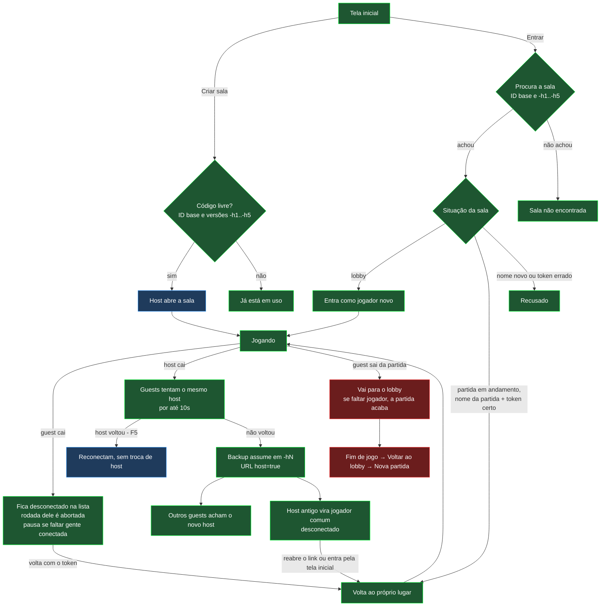

# Testes de conexão — o que está coberto e o que falta

Mapa dos casos de conexão do jogo (entrada, queda, reconexão, troca de
host) com a situação de cada um. Serve de checklist antes de cada
deploy: nenhum item marcado **P1** pode ficar pendente.

**Legenda**

| Marca | Significado |
|---|---|
| 🤖 | Coberto por teste automatizado (`tests/faseD.test.js`, roda no GitHub Actions a cada push) |
| 👤 | Conferido em teste manual (navegadores reais, GitHub Pages) |
| ⬜ | Falta testar manualmente |
| 🐛 | Bug encontrado, ainda não corrigido |
| ⚠️ | Limitação conhecida (comportamento aceito por ora) |
| **P1** | Obrigatório antes do deploy · **P2** desejável |

> Os testes automatizados simulam o PeerJS: garantem a **lógica** do
> jogo em cada situação, mas não a rede de verdade. Por isso os casos
> que dependem de rede real, tela ou dispositivo continuam na lista
> manual.

---

## 1. Fluxo geral

Cores: **verde** = automatizado e conferido manualmente · **azul** =
só automatizado (falta o manual) · **vermelho** = bug encontrado.

---

## 2. Casos cobertos por teste automatizado (50 testes)

### Entrada na sala e identidade
| Caso | Testes | Manual |
|---|---|---|
| Lobby: guest que cai sai da lista | 🤖 T1 | — |
| Partida em andamento: nome novo recusado | 🤖 T2, T9 | 👤 (nome com maiúsculas diferentes foi recusado) |
| Nome em uso por quem está conectado continua bloqueado | 🤖 T3 | — |
| Nome do próprio host recusado, host não perde o lugar | 🤖 T3b | — |
| Token por sala: criado uma vez, só o hash sai do navegador | 🤖 T22, T23, T24, T29 | — |
| Reconexão com token errado ou sem token recusada | 🤖 T25 | 👤 impostor em outro navegador recusado |
| Estado salvo antes do token (transição) | 🤖 T27 | — |
| Guest manda o token na 1ª conexão e nas reconexões | 🤖 T28 | 👤 |
| Tela inicial acha a sala migrada; sala inexistente e erro de rede com a mensagem certa | 🤖 T47 | 👤 entrou pelo código depois da troca de host |
| Criar sala com código de partida em andamento numa versão migrada | 🤖 T47 | ⬜ resultado a confirmar (houve demora no Edge) |

### Queda e volta de guest
| Caso | Testes | Manual |
|---|---|---|
| Espectador cai: fica na lista, fora do sorteio, volta com tudo | 🤖 T4 | — |
| Participante da rodada cai: rodada abortada, nova dupla | 🤖 T5 | — |
| Falta só conexão: partida pausa e retoma com o mesmo evento | 🤖 T6, T33 | — |
| Ciclo da rodada termina sem esperar o desconectado | 🤖 T8 | — |
| Guest volta com o relógio andando e sem reabrir pergunta já respondida | 🤖 T30–T34 | 👤 (diferença de ~1s entre relógios, esperada) |
| Sala cheia: quem caiu consegue voltar | 🤖 T9 | — |

### Queda e troca de host
| Caso | Testes | Manual |
|---|---|---|
| F5/fechar do host encerra as conexões sem mexer no jogo | 🤖 T12, T13 | — |
| Host volta dentro de 10s: guests reconectam, sem troca de host | 🤖 T38 | ⬜ **P1** |
| Host não volta: backup assume em ~10s, não antes | 🤖 T39, T40 | 👤 |
| Backup desconectado é pulado, o próximo assume | 🤖 T10 | — |
| Novo host marca os outros como desconectados, pausa e retoma | 🤖 T17, T21, T21b, T35 | 👤 |
| Novo host confere o token pelos hashes da lista | 🤖 T26 | — |
| Troca de host no lobby | 🤖 T18 | ⬜ P2 |
| Host antigo volta como jogador comum, com o KPI dele | 🤖 T41, T43 | 👤 (pela tela inicial) |
| Quem assumiu fica com `host=true` na URL (F5 continua host) | 🤖 T42 | ⬜ **P1** |
| Guest acha o host em qualquer versão (`-h1`, `-h2`...) | 🤖 T44, T45 | 👤 (versão 0 e -h1) |
| Assumir como host sem o erro "cannot reconnect" | 🤖 T46 | 👤 |
| Erros do PeerJS depois de aberto não derrubam o peer | 🤖 T19, T20 | — |
| Todo peer usa a configuração única (`CONFIG.PEER`) | 🤖 T36, T37 | — |

### Fim de partida e lobby
| Caso | Testes | Manual |
|---|---|---|
| Fim de jogo: quem cai sai da lista | 🤖 T11 | — |
| Encerrar partida (normal e pausada) | 🤖 T14, T15 | — |
| Voltar ao lobby após o fim de jogo (host e guest) | 🤖 T16, T16b | 🐛 ver seção 3 |
| Sair da partida: se faltar jogador, a partida acaba | 🤖 T7 | 👤 |

---

## 3. Bugs encontrados, ainda não corrigidos

| ID | Situação | Causa |
|---|---|---|
| 🐛 B1 | Com 2 jogadores, o guest sai da partida → a partida acaba → o host volta ao lobby e **não consegue iniciar outra partida** (botão "Iniciar" desabilitado). | "Voltar ao lobby" não limpa a marca de "aguardando no lobby" de quem saiu; o botão conta esse jogador como ausente. O guest também não recebe a lista atualizada. |
| 🐛 B2 | Depois de uma troca de host com a rodada **já encerrada**, a próxima dupla começa sozinha, sem o "Nova Rodada". | O novo host não sabe que a rodada tinha acabado nem quem já respondeu nela (só o host antigo guardava essa lista). Correção planejada: continuar a rodada de onde parou. |

---

## 4. Falta testar manualmente

Cada teste com navegadores **diferentes** (não duas abas do mesmo
navegador — elas compartilham o estado salvo e o token) e com as
janelas visíveis lado a lado (aba em segundo plano fica mais lenta).

| # | Prioridade | Caso | Como testar | Esperado |
|---|---|---|---|---|
| M1 | **P1** | F5 do host no meio de uma pergunta | Host dá F5 com a pergunta aberta | Guests reconectam em poucos segundos, sem troca de host; a partida segue |
| M2 | **P1** | F5 do host com "rodada encerrada" | Host dá F5 esperando o "Nova Rodada" | Continua esperando o clique (hoje suspeito de reabrir a rodada — a investigar) |
| M3 | **P1** | F5 do novo host depois da troca | Depois que o guest assumiu, ele dá F5 | Volta como host na mesma sala; os outros reconectam |
| M4 | **P1** | Host antigo reabre o **link antigo** da partida (não a tela inicial), em até 5 min | Fechar a aba do host, esperar a troca, reabrir pelo histórico | Entra como jogador comum; URL passa a `host=false` |
| M5 | **P1** | Troca de host com 3 jogadores | Host fecha a aba | O backup assume e o terceiro jogador acha o novo host sozinho |
| M6 | **P1** | Guest cai e volta | Guest dá F5 no meio da própria pergunta; outro guest fecha e volta pela tela inicial | Voltam ao próprio lugar, com KPI; rodada tratada como nos testes T5/T34 |
| M7 | **P1** | Queda de rede real (não fechar aba) | Desligar o Wi-Fi do guest por 20s; depois do host | Guest: volta sozinho ou ao recarregar. Host: troca de host depois de perceber a queda (mais lento que fechar a aba) |
| M8 | **P1** | Celular com tela bloqueada / navegador em segundo plano | Bloquear o celular por 1 min no meio da partida | Ao desbloquear, volta à partida (ou ao recarregar) |
| M9 | **P1** | Redes diferentes | Host no Wi-Fi da instituição, guest no 4G | Conecta. **Risco:** redes corporativas/universitárias podem bloquear a conexão direta entre navegadores sem um servidor de retransmissão (TURN) |
| M10 | **P1** | Nova partida depois de "saiu da partida" | 2 jogadores; guest sai; host volta ao lobby e inicia outra | Hoje falha (🐛 B1) |
| M11 | P2 | Duas trocas de host seguidas | 3 jogadores: host sai; depois o novo host sai | Sala vai para `-h2`; entrar pela tela inicial com o código funciona |
| M12 | P2 | Troca de host no lobby | Host fecha a aba antes de iniciar | Backup assume; os outros voltam como jogadores novos |
| M13 | P2 | Host sai com a partida pausada | Pausar (guest cai), depois o host fecha | Novo host segue pausado e retoma quando der |
| M14 | P2 | Criar sala com código em uso | Código de sala aberta e de sala migrada | "Já está em uso", em até ~2s |
| M15 | P2 | Sala cheia (6 jogadores) | 6 navegadores/dispositivos; 1 cai e volta | Volta ao lugar; 7º nome é recusado |
| M16 | P2 | Reusar o código depois que todos saem | Todos fecham; reabrir em 1 min e depois de 5 min | Até 5 min restaura a partida; depois, lobby novo |
| M17 | P2 | Navegadores | Chrome, Edge (inclusive InPrivate), Firefox, Safari no iPhone | Mesmo comportamento |
| M18 | P2 | Aba em segundo plano por muito tempo | Deixar a aba escondida 10 min | Ao voltar, o jogo se recupera (pode precisar de F5) |

---

## 5. Limitações conhecidas (aceitas por ora)

- ⚠️ Nomes diferenciam maiúsculas: "vHost" e "Vhost" são jogadores diferentes — durante a partida, a grafia errada é recusada.
- ⚠️ Abas do mesmo navegador compartilham o token e o estado salvo; trocar de navegador, usar aba anônima ou limpar os dados no meio da partida perde a identidade (só volta no lobby).
- ⚠️ Janela de menos de 1s em que o host antigo, recarregando exatamente enquanto o backup assume, pode reabrir a sala antiga (dois hosts).
- ⚠️ A procura da sala olha até 5 trocas de host seguidas (`-h5`).
- ⚠️ Depois de 5 tentativas sem achar o novo host, o guest desiste (precisa recarregar).
- ⚠️ Diferença de ~1s entre o relógio do host e o dos guests que reconectam.

---

## 6. Automação que ainda dá para fazer

Um teste de ponta a ponta com navegadores de verdade rodando no GitHub
Actions (Playwright + servidor PeerJS local + servidor estático do
jogo) cobriria de forma automática a maior parte da seção 4:

- **Automatizáveis:** M1–M6, M10–M16 (vários navegadores simulados na
  mesma máquina: fechar aba, recarregar, reabrir link, entrar pela tela
  inicial) e boa parte de M7 (o Playwright simula ficar sem rede).
- **Continuam manuais:** M8 (celular), M9 (redes reais diferentes),
  M17 em Safari/iPhone e M18.

Com isso, cada push passaria a testar também a rede, e não só a
lógica.