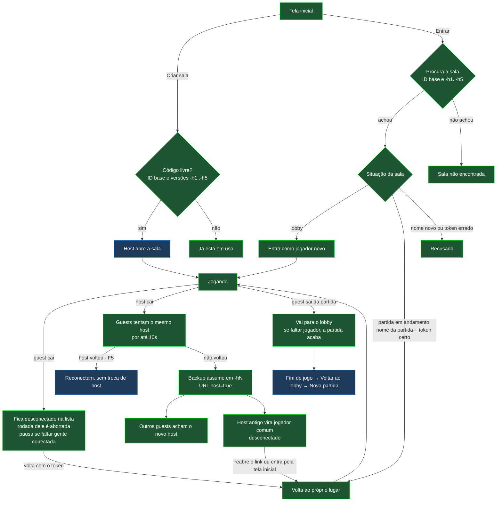

# Testes de conexão — o que está coberto e o que falta

Mapa dos casos de conexão do jogo (entrada, queda, reconexão, troca de
host) com a situação de cada um. Serve de checklist antes de cada
deploy: nenhum item marcado **P1** pode ficar pendente.

**Legenda**

| Marca | Significado |
|---|---|
| 🤖 | Coberto por teste automatizado (`tests/faseD.test.js`, roda no GitHub Actions a cada push) |
| 🌐 | Coberto por teste de ponta a ponta (`tests/e2e`, jogo de verdade no Chromium, roda no GitHub Actions a cada push) |
| 👤 | Conferido em teste manual (navegadores reais, GitHub Pages) |
| ⬜ | Falta testar manualmente |
| 🐛 | Bug encontrado, ainda não corrigido |
| ⚠️ | Limitação conhecida (comportamento aceito por ora) |
| **P1** | Obrigatório antes do deploy · **P2** desejável |

> Os testes de `tests/faseD.test.js` simulam o PeerJS: garantem a
> **lógica** do jogo em cada situação. Os de ponta a ponta (`tests/e2e`)
> rodam o jogo de verdade em janelas separadas do Chromium, com um
> servidor PeerJS local — cobrem a conexão, mas não redes reais
> diferentes, celular nem outros navegadores. Esses continuam na lista
> manual.

---

## 1. Fluxo geral

Cores: **verde** = automatizado e conferido manualmente · **azul** =
só automatizado (falta o manual).

---

## 2. Casos cobertos por teste automatizado (66 testes)

### Entrada na sala e identidade
| Caso | Testes | Manual |
|---|---|---|
| Lobby: guest que cai sai da lista | 🤖 T1 | — |
| Partida em andamento: nome novo recusado | 🤖 T2, T9 | 👤 (nome com maiúsculas diferentes foi recusado) |
| Nome em uso por quem está conectado continua bloqueado | 🤖 T3 | — |
| Nome do próprio host recusado, host não perde o lugar | 🤖 T3b | — |
| Token por sala: criado uma vez, só o hash sai do navegador | 🤖 T22, T23, T24, T29 | — |
| Reconexão com token errado ou sem token recusada | 🤖 T25 | 👤 impostor em outro navegador recusado |
| Estado salvo antes do token (transição) | 🤖 T27 | — |
| Guest manda o token na 1ª conexão e nas reconexões | 🤖 T28 | 👤 |
| Tela inicial acha a sala migrada; sala inexistente e erro de rede com a mensagem certa | 🤖 T47 | 👤 entrou pelo código depois da troca de host |
| Criar sala com código de sala aberta ou de partida em andamento numa versão migrada: "já está em uso" em até 3s; código livre é aceito | 🤖 T47 · 🌐 E13 | ⬜ no Edge do Windows houve travamento de ~5s (seção 5) |

### Queda e volta de guest
| Caso | Testes | Manual |
|---|---|---|
| Espectador cai: fica na lista, fora do sorteio, volta com tudo | 🤖 T4 | — |
| Participante da rodada cai: rodada abortada, nova dupla | 🤖 T5 | — |
| Falta só conexão: partida pausa e retoma com o mesmo evento | 🤖 T6, T33 | — |
| Ciclo da rodada termina sem esperar o desconectado | 🤖 T8 | — |
| Guest volta com o relógio andando e sem reabrir pergunta já respondida | 🤖 T30–T34 | 👤 (diferença de ~1s entre relógios, esperada) |
| Sala cheia: 7º nome recusado no lobby; quem caiu consegue voltar | 🤖 T9 · 🌐 E16 | — (coberto por E16) |

### Queda e troca de host
| Caso | Testes | Manual |
|---|---|---|
| F5/fechar do host encerra as conexões sem mexer no jogo | 🤖 T12, T13 | — |
| Host volta dentro de 10s: guests reconectam, sem troca de host | 🤖 T38 · 🌐 E1 | — (coberto por E1) |
| F5 do host com a pergunta aberta: a mesma pergunta continua; relógio e prazo de resposta religados | 🤖 T56 · 🌐 E1 | — (coberto por E1) |
| F5 do host com a rodada encerrada: continua encerrada para todos, nada começa sozinho | 🤖 T53, T57 · 🌐 E9 | — (coberto por E9) |
| F5 do host logo depois de uma resposta: segue para a próxima dupla ou encerra a rodada; se a resposta completou a última fase, a partida termina | 🤖 T54, T58 · 🌐 E10 | — (coberto por E10) |
| F5 do host com a partida pausada: continua pausada com o mesmo evento e retoma quando alguém volta | 🤖 T55, T57 · 🌐 E11 | — (coberto por E11) |
| F5 do host com um pedido de assessoria sem resposta: o pedido é cancelado, quem responde pode pedir de novo e a rodada segue; assessoria já respondida continua valendo | 🤖 T59, T60 · 🌐 E12 | — (coberto por E12) |
| Host não volta: backup assume em ~10s, não antes | 🤖 T39, T40 · 🌐 E2 | 👤 |
| Backup desconectado é pulado, o próximo assume | 🤖 T10 | — |
| Novo host marca os outros como desconectados, pausa e retoma | 🤖 T17, T21, T21b | 👤 |
| Todos recebem quem já respondeu na rodada (resposta, nova dupla, reconexão) | 🤖 T49 | — |
| Troca de host com a rodada encerrada: continua encerrada, nada começa sozinho | 🤖 T35, T50 · 🌐 E5 | 👤 |
| Troca de host no meio da rodada: quem ia responder não perde a vez; ninguém responde duas vezes | 🤖 T50, T51 · 🌐 E4 | — (coberto por E4) |
| Novo host confere o token pelos hashes da lista | 🤖 T26 | — |
| Troca de host no lobby: os outros voltam como jogadores novos; host antigo pelo link antigo vira jogador comum | 🤖 T18 · 🌐 E14 | — (coberto por E14) |
| Duas trocas de host seguidas: sala em `-h2`, achada pela tela inicial e pelo link antigo do host de `-h1` | 🌐 E15 | — (coberto por E15) |
| Host antigo volta como jogador comum, com o KPI dele | 🤖 T41, T43 · 🌐 E5 (link antigo), E3 (tela inicial) | 👤 (pela tela inicial) |
| Quem assumiu fica com `host=true` na URL (F5 continua host) | 🤖 T42 · 🌐 E2 | — (coberto por E2) |
| Guest acha o host em qualquer versão (`-h1`, `-h2`...) | 🤖 T44, T45 | 👤 (versão 0 e -h1) |
| Assumir como host sem o erro "cannot reconnect" | 🤖 T46 | 👤 |
| Erros do PeerJS depois de aberto não derrubam o peer | 🤖 T19, T20 | — |
| Todo peer usa a configuração única (`CONFIG.PEER`) | 🤖 T36, T37 | — |

### Fim de partida e lobby
| Caso | Testes | Manual |
|---|---|---|
| Fim de jogo: quem cai sai da lista | 🤖 T11 | — |
| Encerrar partida (normal e pausada) | 🤖 T14, T15 | — |
| Voltar ao lobby após o fim de jogo (host e guest) | 🤖 T16, T16b | — |
| Guest sai da partida, ela acaba, e o host inicia outra | 🤖 T48 · 🌐 E8 | 👤 |
| Pausa retomada com todos os conectados já tendo respondido: rodada encerra em vez de recomeçar | 🤖 T52 | — |
| Sair da partida: se faltar jogador, a partida acaba | 🤖 T7 | 👤 |
| Todos saem e a sala é reaberta: até 5 min a partida é restaurada (pausada, com o mesmo evento); depois, lobby novo | 🌐 E17, E18 | — (coberto por E17 e E18) |

---

## 3. Bugs encontrados, ainda não corrigidos

Nenhum no momento.

Em investigação fora da conexão: BUG-020 (tela do host depois do F5 com
a pergunta aberta), em `ISSUES.md`.

Corrigidos: B1 (botão "Iniciar" desabilitado depois de um "Sair da
partida") na D3d; B2 (rodada que começava sozinha depois de uma troca de
host) na D3e; B3, B4 e B5 (F5 do host em momentos específicos da
partida, encontrados com navegadores reais em 03/10/2026) na D3f;
BUG-019 (F5 do host com assessoria pendente, ver `ISSUES.md`) em
03/10/2026:

| ID | Situação antes da correção | Causa |
|---|---|---|
| B3 | F5 do host com a rodada encerrada: o host voltava com "Aguardando início da rodada..." e os outros viam a última dupla como em andamento, em vez de "Rodada encerrada" | "Rodada encerrada" não era salvo, e a retomada reexibia a última rodada (já respondida) |
| B4 | F5 do host logo depois de uma resposta, nos ~3s antes da próxima dupla: a partida travava ("Nova Rodada" bloqueado, nenhuma dupla nova) | O aviso para seguir à próxima dupla (agendado para 3s depois) se perdia com a página, e a retomada reabria a pergunta já respondida |
| B5 | F5 do host com a partida pausada: sorteava outro evento e reaplicava os efeitos | A pausa não era salva, e a retomada começava uma rodada nova |
| BUG-019 | F5 do host com um pedido de assessoria sem resposta: quem responde ficava com os botões travados e a rodada parada até acabar o tempo da partida | O prazo do assessor se perdia com a página, e o assessor perdia a pergunta ao reconectar |

---

## 4. Falta testar manualmente

Cada teste com navegadores **diferentes** (não duas abas do mesmo
navegador — elas compartilham o estado salvo e o token) e com as
janelas visíveis lado a lado (aba em segundo plano fica mais lenta).

| # | Prioridade | Caso | Como testar | Esperado |
|---|---|---|---|---|
| M1 | ✅ 🌐 E1 | F5 do host no meio de uma pergunta | Host dá F5 com a pergunta aberta | Guests reconectam em poucos segundos, sem troca de host; a partida segue |
| M2 | ✅ 🌐 E9 | F5 do host com "rodada encerrada" | Host dá F5 esperando o "Nova Rodada" | Continua "Rodada encerrada" para todos, esperando o clique (B3 corrigido na D3f) |
| M3 | ✅ 🌐 E2 | F5 do novo host depois da troca | Depois que o guest assumiu, ele dá F5 | Volta como host na mesma sala; os outros reconectam |
| M4 | ✅ 🌐 E5 | Host antigo reabre o **link antigo** da partida (não a tela inicial), em até 5 min | Fechar a aba do host, esperar a troca, reabrir pelo histórico | Entra como jogador comum; URL passa a `host=false` |
| M5 | ✅ 🌐 E4 | Troca de host com 3 jogadores | Host fecha a aba | O backup assume e o terceiro jogador acha o novo host sozinho |
| M6 | ✅ 🌐 E6 | Guest cai e volta | Guest dá F5 no meio da própria pergunta; outro guest fecha e volta pela tela inicial | Voltam ao próprio lugar, com KPI; rodada tratada como nos testes T5/T34 |
| M7 | **P1** | Queda de rede real (não fechar aba) | Desligar o Wi-Fi do guest por 20s; depois do host | Guest: volta sozinho ou ao recarregar. Host: troca de host depois de perceber a queda (mais lento que fechar a aba) |
| M8 | **P1** | Celular com tela bloqueada / navegador em segundo plano | Bloquear o celular por 1 min no meio da partida | Ao desbloquear, volta à partida (ou ao recarregar) |
| M9 | **P1** | Redes diferentes | Host no Wi-Fi da instituição, guest no 4G | Conecta. **Risco:** redes corporativas/universitárias podem bloquear a conexão direta entre navegadores sem um servidor de retransmissão (TURN) |
| M10 | ✅ 🌐 E8 | Nova partida depois de "saiu da partida" | 2 jogadores; guest sai; host volta ao lobby e inicia outra | Conferido em 30/09/2026 |
| M11 | ✅ 🌐 E15 | Duas trocas de host seguidas | 3 jogadores: host sai; depois o novo host sai | Sala vai para `-h2`; entrar pela tela inicial com o código funciona |
| M12 | ✅ 🌐 E14 | Troca de host no lobby | Host fecha a aba antes de iniciar | Backup assume; os outros voltam como jogadores novos |
| M13 | ✅ 🌐 E17 | Host sai com a partida pausada | Guest cai (a partida pausa), depois o host fecha a aba e a reabre | Continua pausada com o mesmo evento e retoma quando o guest volta. Obs.: a partida só pausa quando o host é o único conectado, então não sobra ninguém para assumir — o caso real é o host voltar em até 5 min (M16) |
| M14 | ✅ 🌐 E13 | Criar sala com código em uso | Código de sala aberta e de sala migrada | "Já está em uso", em até ~2s (no teste, até 3s) |
| M15 | ✅ 🌐 E16 | Sala cheia (6 jogadores) | 6 navegadores/dispositivos; 1 cai e volta | Volta ao lugar; 7º nome é recusado |
| M16 | ✅ 🌐 E17, E18 | Reusar o código depois que todos saem | Todos fecham; reabrir em 1 min e depois de 5 min | Até 5 min restaura a partida; depois, lobby novo |
| M17 | P2 | Navegadores | Chrome, Edge (inclusive InPrivate), Firefox, Safari no iPhone | Mesmo comportamento |
| M18 | P2 | Aba em segundo plano por muito tempo | Deixar a aba escondida 10 min | Ao voltar, o jogo se recupera (pode precisar de F5) |
| M19 | ✅ 👤 🌐 E5 | Troca de host com a rodada encerrada | Todos respondem; com "Rodada encerrada" na tela, o host fecha a aba | O novo host vê "Rodada encerrada" com o "Nova Rodada" liberado; quando os outros voltam, nada começa sozinho |
| M20 | ✅ 🌐 E4 | Troca de host no meio da rodada | 3 jogadores; o host fecha a aba no meio de uma pergunta que não é do novo host | A partida pausa e, quando alguém volta, continua com quem ainda não respondeu; ninguém responde duas vezes na mesma rodada |

---

## 5. Limitações conhecidas (aceitas por ora)

- ⚠️ Nomes diferenciam maiúsculas: "vHost" e "Vhost" são jogadores diferentes — durante a partida, a grafia errada é recusada. Melhoria futura (roadmap 8.5).
- ⚠️ Abas do mesmo navegador compartilham o token e o estado salvo; trocar de navegador, usar aba anônima ou limpar os dados no meio da partida perde a identidade (só volta no lobby).
- ⚠️ Janela de menos de 1s em que o host antigo, recarregando exatamente enquanto o backup assume, pode reabrir a sala antiga (dois hosts).
- ⚠️ A procura da sala olha até 5 trocas de host seguidas (`-h5`).
- ⚠️ Depois de 5 tentativas sem achar o novo host, o guest desiste (precisa recarregar).
- ⚠️ Diferença de ~1s entre o relógio do host e o dos guests que reconectam.
- ⚠️ **Em investigação:** travamentos do Edge no Windows (uma vez travou o computador inteiro; outra, ~5s ao criar sala). Reproduzindo o mesmo cenário no Chromium (mesmo motor do Edge), a página não travou: nenhuma tarefa acima de 100 ms, e memória e elementos da página estáveis durante a partida. Falta medir no próprio Edge (Gerenciador de Tarefas do navegador, Shift+Esc) e comparar com o Chrome na mesma máquina.

---

## 6. Testes de ponta a ponta (`tests/e2e`)

O jogo de verdade, em janelas separadas do Chromium (cada uma com
armazenamento e token próprios, como navegadores diferentes), com um
servidor PeerJS e o site servidos localmente dentro do GitHub Actions —
sem depender da internet nem do servidor público. Os arquivos do jogo
não mudam: o teste só aponta o PeerJS para o servidor local.

| # | Cenário | Cobre |
|---|---|---|
| E1 | F5 do host no meio da pergunta: o outro reconecta ao mesmo host, sem troca de host; a rodada vai até o fim | M1 |
| E2 | Host fecha a aba: outro assume em ~10s (não antes de 7s); URL `host=true`; F5 do novo host continua host | M3 |
| E3 | Host antigo volta pela tela inicial digitando o código: acha a sala em `-h1` e entra como jogador comum, com o KPI dele | — |
| E4 | 3 jogadores, host sai no meio da pergunta de um guest (com alguém já tendo respondido): o terceiro acha o novo host; ninguém responde duas vezes; quem ia responder não perde a vez | M5, M20 |
| E5 | Troca de host com a rodada encerrada: continua encerrada; host antigo volta pelo link antigo como jogador comum; nada começa até o "Nova Rodada" | M4, M19 |
| E6 | Jogador dá F5; outro fecha e volta pela tela inicial; nome novo é recusado; a rodada vai até o fim | M6 |
| E8 | Jogador sai da partida, ela acaba; voltar ao lobby e iniciar outra | M10 |
| E9 | F5 do host com a rodada encerrada: continua encerrada para os dois, "Nova Rodada" liberado, nada começa sozinho | M2, B3 |
| E10 | F5 do host logo depois de responder: a partida segue (próxima dupla ou fim da rodada) e a rodada seguinte começa | B4 |
| E11 | F5 do host com a partida pausada: continua pausada com o mesmo evento, sem mostrar outro; retoma quando o outro volta | B5 |
| E12 | 3 jogadores; um guest pede assessoria, o assessor não responde e o host dá F5: o guest volta com os botões e o "Pedir Assessoria" liberados, responde e a partida segue | BUG-019 |
| E13 | Criar sala pela tela inicial com o código de uma sala aberta e, depois da troca de host, de uma sala migrada: "já está em uso" em até 3s, sem derrubar ninguém; código livre chega a "Sala criada" | M14 |
| E14 | Host fecha a aba no lobby: outro assume em `-h1` e fica só com quem voltou; o terceiro entra como jogador novo; o host antigo reabre o link antigo e vira jogador comum; a partida começa com os três | M12 |
| E15 | Duas trocas de host seguidas (sala em `-h2`): o primeiro host volta pela tela inicial, com o KPI dele; o host de `-h1` reabre o link dele e vira jogador comum; a partida retoma | M11 |
| E16 | 6 jogadores: o 7º é recusado no lobby ("Sala cheia"); com a partida em andamento, um cai e volta ao próprio lugar | M15 |
| E17 | Guest sai (pausa), depois o host; o host reabre: continua pausada com o mesmo evento, sem mostrar outro; retoma quando o guest volta | M13, M16 (até 5 min) |
| E18 | Todos saem e voltam depois de 5 min: lobby novo, quem volta entra como jogador novo e uma partida nova começa | M16 (depois de 5 min) |

Queda de rede (M7) não entrou: a simulação de "sem rede" do navegador
não derruba a conexão direta entre janelas na mesma máquina (conferido —
as mensagens continuaram chegando), então o cenário não testaria nada.
Continua manual.

No E18, os 5 minutos não são esperados de verdade (cada cenário tem
limite de 2 minutos): antes de reabrir, o teste muda a hora gravada no
estado salvo de cada navegador para 6 minutos atrás — o mesmo dado que
o jogo usa para decidir se restaura.

**Continuam manuais:** M7 (queda de rede real), M8 (celular), M9 (redes
reais diferentes), M17 (Firefox, Safari) e M18 (aba esquecida em
segundo plano).

Rodar localmente (precisa de Node): `npm ci`, `npx playwright install
chromium` e `npx playwright test --config tests/e2e/playwright.config.js`.